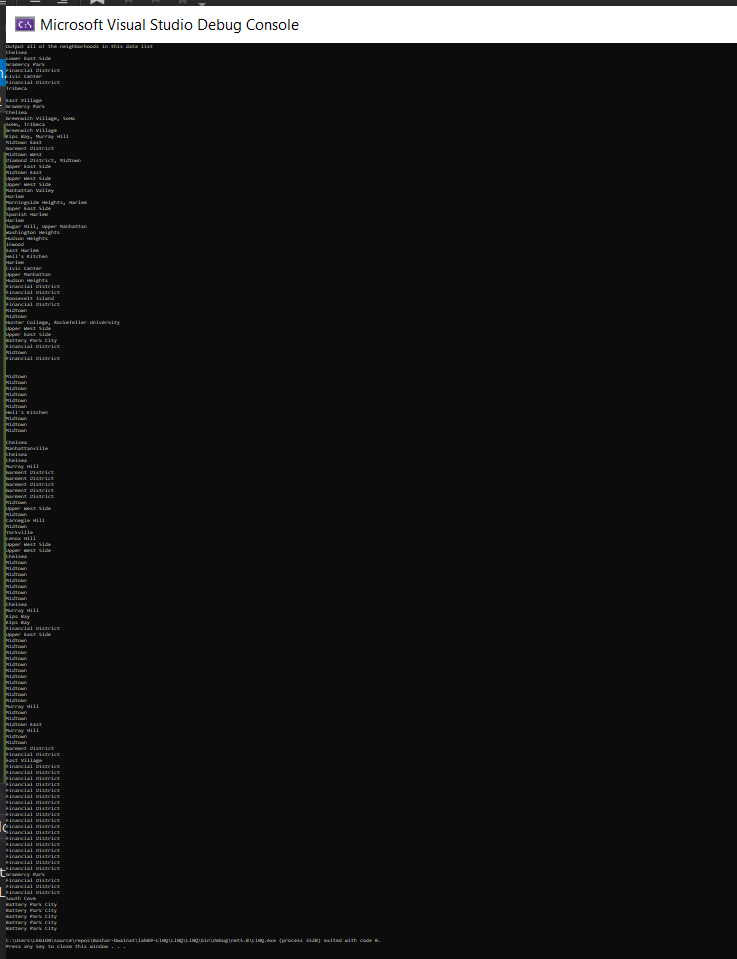
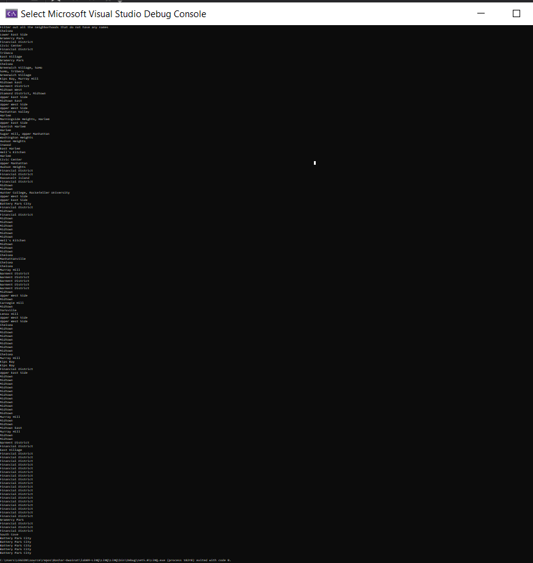
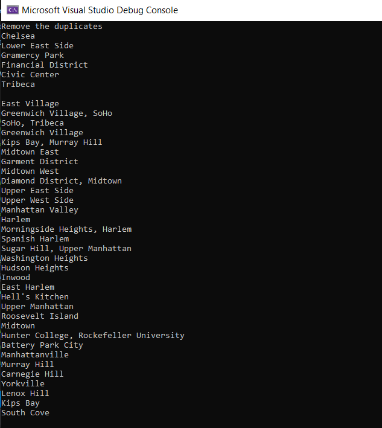
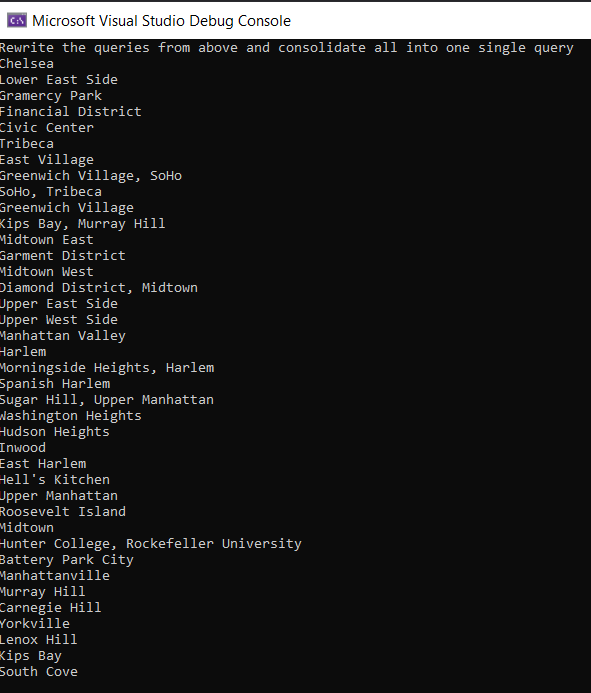

# lab09-LINQ
## Summary 

In this app I read data from an external json file, I seperated them in classes and then I deserialized them and finally I did operations over them.

## Results

Output all of the neighborhoods in this data list 

Filter out all the neighborhoods that do not have any names

Remove the duplicates 

Rewrite the queries from above and consolidate all into one single query.

Rewrite at least one of these questions only using the opposing method

